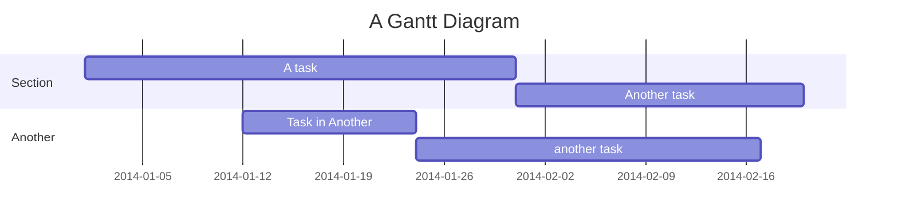

Name:_____________________________         Klasse ____           Datum:__________________________________
# Übung zu Reihen- und Parallelschaltung von Widerständen

Wenn 2 Widerstände $R_1$ und $R_2$ in Reihe geschaltet sind dann _________________ sich ihre Widerstände zum Gesamtwiderstand: 
$R_g=$ ___     ____

Wenn 2 Widerstände $R_1$ und $R_2$ parallel geschaltet sind dann _________________ sich ihre _______________ zum _____________________________:
$\frac{1}{ R_g}=$

1. Berechne den Gesamtwiderstand und die Stromstärke für $R_1=200\Omega$ und $R_2=700\Omega$.
2. Berechne den Gesamtwiderstand und die Spannung.
3. Bestimme den Strom durch den Widerstand.

